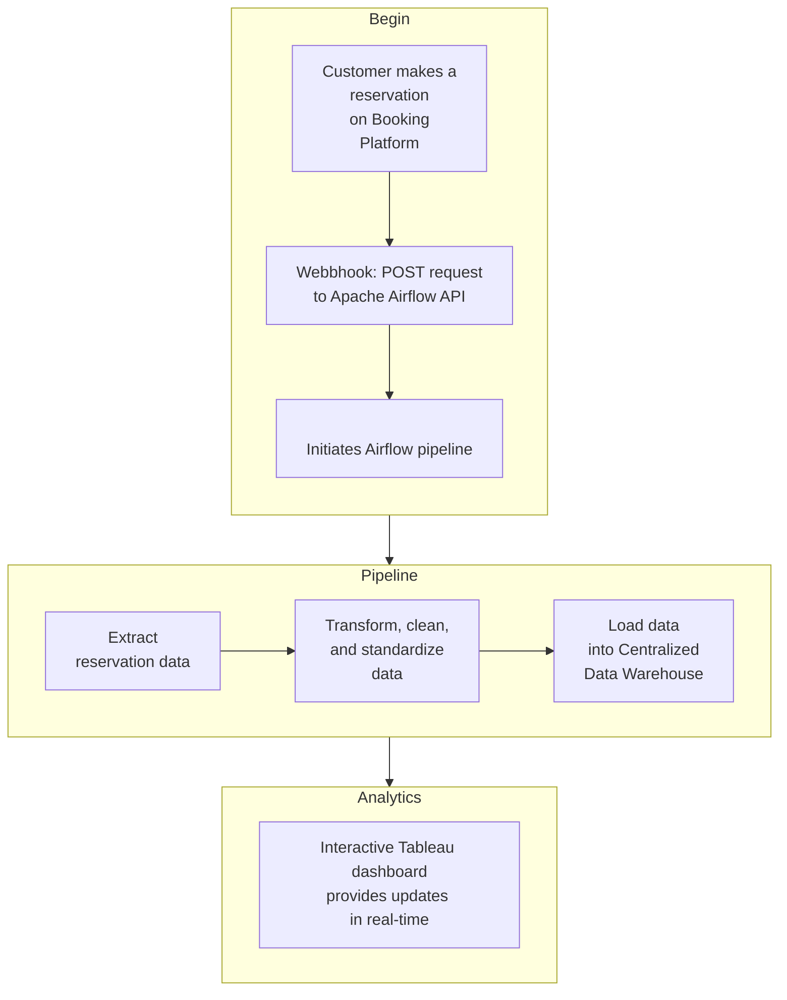

# Automated ETL Pipeline for Multi-Platform Restaurant Booking Data Integration and Analytics

This project simulates a multi-platform restaurant reservation system and demonstrates how to build a real-time data pipeline using Apache Airflow, Django Rest Framework (DRF), and PostgreSQL.

It showcases:
	•	A custom frontend built with Django DRF that mimics how users book tables via popular platforms like OpenTable, TheFork, and Quandoo.
	•	A webhook integration that automatically triggers an Airflow DAG when a new reservation is made.
	•	A centralised PostgreSQL data warehouse where booking data is structured and stored for further analysis and dashboarding.

## Project Motivation

Restaurant today relies on several booking platforms such as The Fork, Quandoo, Open Table, and Design My Nights. When a reservation is made through any of these channels, restaurants receive an immediate email notification, and each platform offers a dedicated web interface where current, past, and future bookings can be viewed. This system allows for real-time updates on guest reservations and historical data, which can be essential for managing capacity and planning operations. 

In the restaurant industry, booking data is often spread across multiple platforms, making it difficult to consolidate and analyse in real-time. This project solves that by:
	•	Simulating multi-platform bookings
	•	Automating the data ingestion and transformation process
	•	Storing clean, structured data in a centralised warehouse

This project implements an ETL pipeline orchestrated by Apache Airflow, designed to automate the whole process without human intervention. The pipeline seamlessly integrates reservation data from multiple platforms into a single, centralised warehouse.  </br>

Since,these booking platform do not provide API endpoints unless you are their customers, I have custom-built API endpoints that closely resembles their endpoints & webhooks, providing realistic representations of data structures and responses from popular reservation platforms such as TheFork, Quandoo, OpenTable, and SevenRooms.

Additionally, the project features an interactive Tableau dashboard providing real-time analytics, offering clear insights into booking trends, reservation patterns, and platform performance metrics to support informed business decisions.

Additionally, this project includes **FindTables**, a basic **Django-based restaurant booking system** that simulates real-world table reservations.



## Features

**Automated ETL Pipeline** – Extracts, transforms, and loads booking data from multiple platforms.  
**Centralized Database** – Stores structured reservation data in **PostgreSQL/MySQL**.  
**Data Standardization** – Ensures uniformity in booking data across platforms.  
**Interactive Dashboard** – Analyzes booking trends, occupancy rates, and platform performance.  
**Django-Based Booking System** – Simulates restaurant reservations via API endpoints.  
**Webhook Simulation** – Simulates real-time booking updates from platforms.  
**Cloud-Ready Architecture** – Can be deployed on **AWS, Docker, or local environments**.  

---

## Project Structure

```
📂 restaurant-booking-management  
│── 📂 dags/                   # Apache Airflow DAGs for ETL workflows
│── 📂 dags/helpers            # Data extraction & transformation scripts    
│── 📂 FindTables/             # Django-based FindTables booking system  
│── 📂 queries/                # PostgreSQL schema and scripts  
│── 📂 dashboards/             # Tableau dashboard files  
│── 📜 README.md                  # Project documentation  

```

---

## Tech Stack

| Component           | Technology Used |
|---------------------|----------------|
| **Orchestration**  | Apache Airflow  |
| **Backend**        | Django & DRF |
| **Database**       | PostgreSQL|
| **Data Validation & Processing** | Pydantic, Pandas, Python |
| **Visualization**  | Tableau |
| **Frontend**       | jQuery, HTML, CSS |
| **Deployment**     | Docker, AWS |

---

## Workflow Overview

User books a table through a simulated frontend (built using Django DRF).
	2.	A custom webhook sends booking data to Airflow.
	3.	An Airflow DAG is triggered, fetching the reservation data.
	4.	The data is cleaned, transformed, and loaded into a central PostgreSQL warehouse.
	5.	(Optional) Use Tableau / Power BI to create dashboards on top of the warehouse.


## 📜 License
This project is licensed under the **MIT License**.

