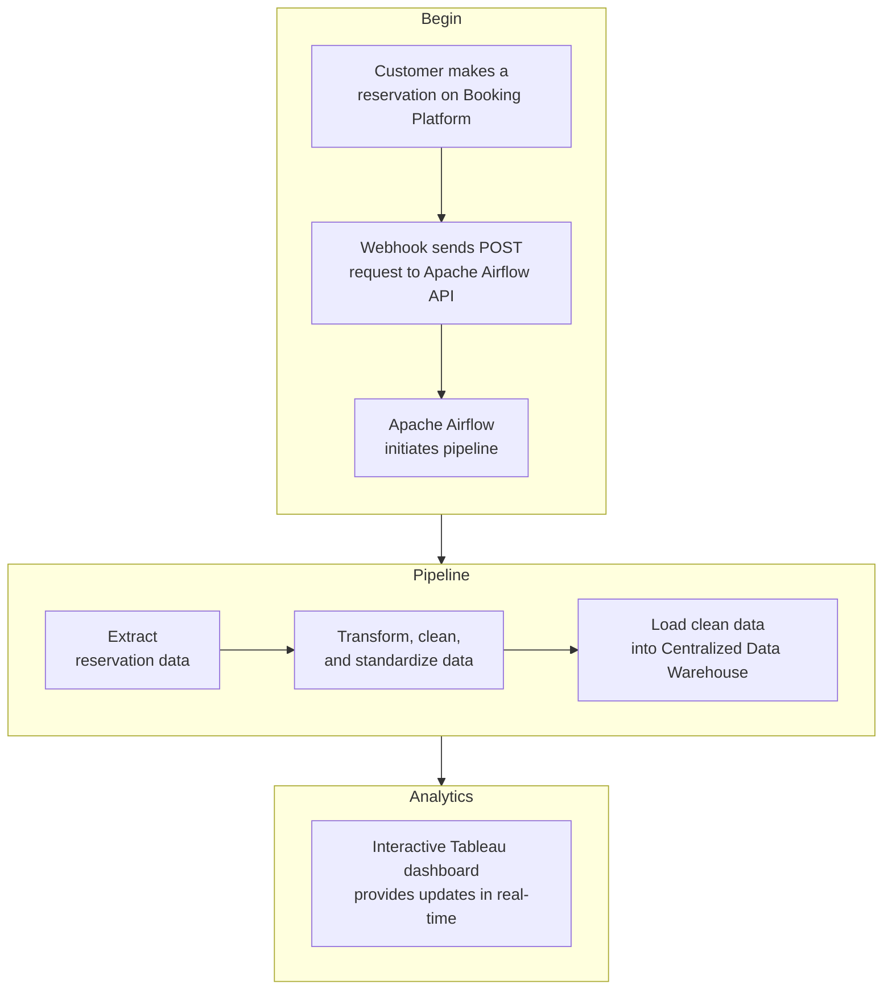

# Automated ETL Pipeline for Multi-Platform Restaurant Booking Data Integration and Analytics

## Project Overview

Restaurant today relies on several booking platforms such as The Fork, Quandoo, Open Table, and Design My Nights. When a reservation is made through any of these channels, restaurants receive an immediate email notification, and each platform offers a dedicated web interface where current, past, and future bookings can be viewed. This system allows for real-time updates on guest reservations and historical data, which can be essential for managing capacity and planning operations. 

While these platforms are primarily booking tools—not full management systems—restaurants are left with two options: either manage reservations individually in each web interface or migrate the data into a centralized management system for operational efficiency. 
Now, a significant challenge emerges: migrating all bookings into a single table/restaurant management system. 

While these booking platforms do offer APIs that can theoretically integrate with popular restaurant management systems. But, it comes with a cost. 
These platform already charge a flat fee for each of the bookings made via their service. 
If you want to use their API for automating the process of migrating the data, you must pay for premium subscription. These subscriptions can come with steep costs and long term commitment(Contracts)—making it particularly challenging for small and medium-sized enterprises to afford and manage. 
Remember, you are not just paying or one! 

Therefore, many restaurants opt for the cheapest option: pay the flat fee and manually migrate the incoming reservation data into their internal management system.

It is not efficient, but it works if you just want to manage reservations. However, human error can introduce potential inaccuracies, making it cumbersome to effectively conduct analytics and support informed decision-making.

This lack of a automated, centralised system severely hampers efficient operational management, analytics capabilities, and strategic decision-making. 

This project implements an ETL pipeline orchestrated by Apache Airflow, designed to automate the process without human intervention. The pipeline seamlessly integrates reservation data from multiple platforms into a single, centralised warehouse.  </br>

Since,these platform do not provide API endpoints unsless you are their customers, I have custom-built API endpoints that closely their endpoints & webhooks, providing realistic representations of data structures and responses from popular reservation platforms such as TheFork, Quandoo, OpenTable, and SevenRooms.


Additionally, the project features an interactive Tableau dashboard providing real-time analytics, offering clear insights into booking trends, reservation patterns, and platform performance metrics to support informed business decisions.

Additionally, this project includes **FindTables**, a basic **Django-based restaurant booking system** that simulates real-world table reservations. Users can make and manage reservations through API endpoints and a **frontend**.


<div align="center">
  
</div>

---

## Features

**Automated ETL Pipeline** – Extracts, transforms, and loads booking data from multiple platforms.  
**Centralized Database** – Stores structured reservation data in **PostgreSQL/MySQL**.  
**Data Standardization** – Ensures uniformity in booking data across platforms.  
**Interactive Dashboard** – Analyzes booking trends, occupancy rates, and platform performance.  
**Django-Based Booking System** – Simulates restaurant reservations via API endpoints.  
**Webhook Simulation** – Simulates real-time booking updates from platforms.  
**Cloud-Ready Architecture** – Can be deployed on **AWS, Docker, or local environments**.  

---

## Project Structure

```
📂 restaurant-booking-management  
│── 📂 dags/                   # Apache Airflow DAGs for ETL workflows
│── 📂 dags/helpers            # Data extraction & transformation scripts    
│── 📂 FindTables/             # Django-based FindTables booking system  
│── 📂 queries/                # PostgreSQL schema and scripts  
│── 📂 dashboards/             # Tableau dashboard files  
│── 📜 README.md                  # Project documentation  

```

---

## Tech Stack

| Component           | Technology Used |
|---------------------|----------------|
| **Orchestration**  | Apache Airflow  |
| **Backend**        | Django & DRF |
| **Database**       | PostgreSQL|
| **Data Processing** | Pydantic, Pandas, Python |
| **Visualization**  | Tableau |
| **Frontend**       | jQuery, HTML, CSS |
| **Deployment**     | Docker, AWS |

---

## How It Works

### Extract Booking Data
- Airflow DAGs receives **reservation data** from custom built webhooks in Django.
- Data is fetched in different formats (JSON, CSV) and standardized.

### Transform & Standardize
- Python scripts clean, validate, and standardize booking data.
- Ensures uniformity across seperate databases. 

### Load into Database
- Standardized data is stored in **PostgreSQL**.
- Enables **efficient querying** and integration with the dashboard.

### Dashboard Analysis
- Tableau visualizes:
  - **Booking trends** across platforms
  - **Occupancy rates** per restaurant
  - **Platform performance** comparisons

### FindTables - Django-Based Booking System
- Allows users to **simulate restaurant bookings** via API.
- Stores bookings in the central database.

### Webhook Simulation
- Simulates real-time booking updates from different platforms.
- Updates database whenever a **reservation is modified or canceled**.

## 📜 License
This project is licensed under the **MIT License**.

---

## 📩 Contact & Contributions
- **Author:** Paritosh   
- **Contributions:** PRs are welcome! Open an issue for suggestions.  
